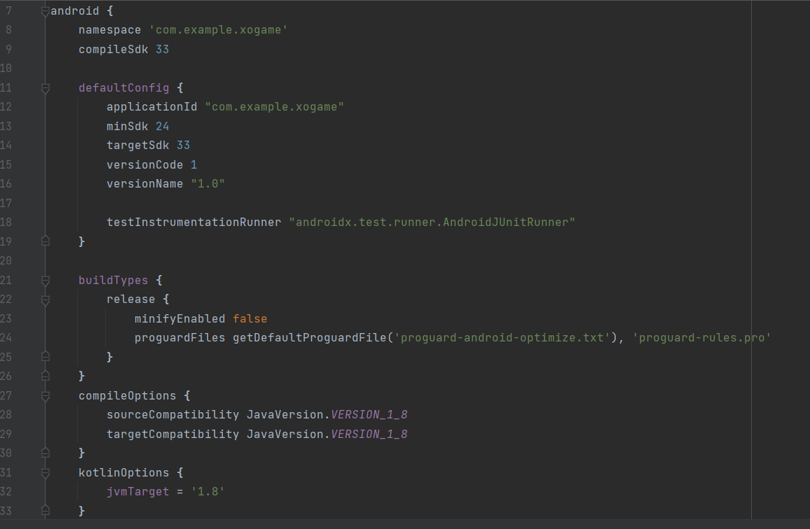
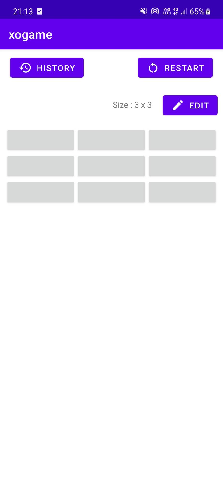
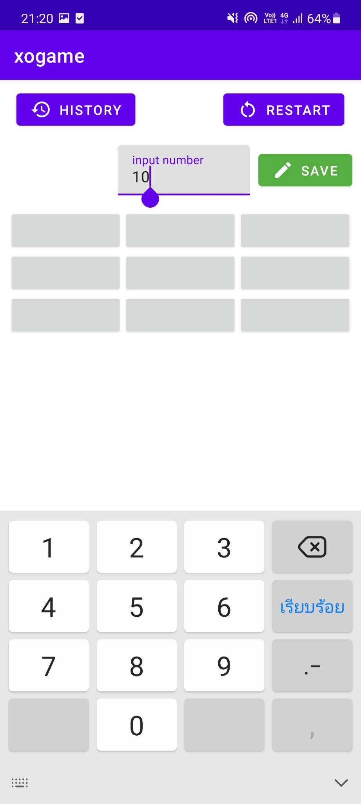
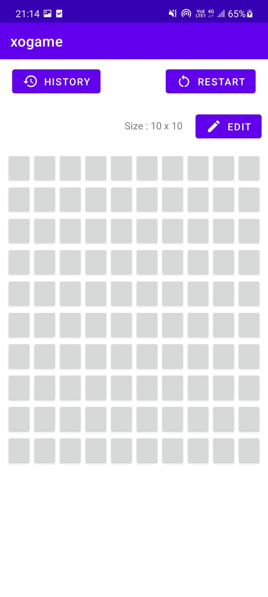
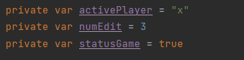
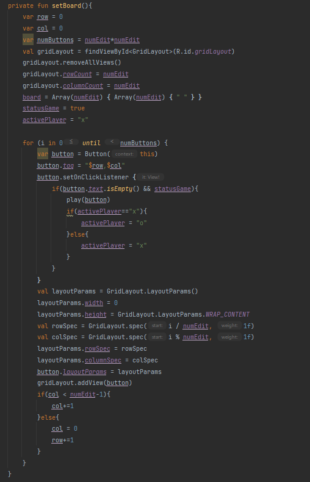

# xogame kotlin project
build.gradle file

##

# การออกแบบและ algorithm

## การจัดการตาราง
เมื่อเริ่มต้นแอปพลิเคชันจะกำหนดขนาดของตารางเริ่มต้นที่ 3x3 สามารถปรับขนาดที่ปุ่ม Edit

     

ตัวแปร activePlayer เป็นตัวตรวจสอบว่า ณ ตอนนี้เป็นตาของ Player คนไหน ส่วนตัวแปร numEdit เป็นตัวกำหนด size ในส่วนของตัวแปร statusGame จะตรวจสอบว่าเกมยังดำเนินไปหรือไม่

ฟังก์ชัน setBoard() จะเป็นฟังก์ชันสำหรับจัดการขนาดรูปแบบของตารางและกำหนดค่าให้กับปุ่ม 

ทำงานโดยนำตัวแปร numEdit ไปหาจำนวนปุ่มทั้งหมดเก็บไว้ที่ numButtons เพื่อนำไปเพิ่มปุ่มตามรูปแบบของตาราง

มีการตั้งค่าตัวแปร board ตัวแปร Array 2 มิติ ตามขนาดของตาราง ใช้ในการเก็บค่า x,o เพื่อตรวจสอบผลชนะ

ส่วนการทำงานของปุ่มแต่ละปุ่มจะตรวจสอบว่าถ้าปุ่มนั้นยังไม่มีการกำหนดค่า และเกมยังคงดำเนินอยู่ จะทำการ set ค่า x,o ให้ปุ่มที่ฟังก์ชัน play(button) และ set ค่า ตัวแปร activePlayer เพื่อเปลี่ยนตาของผู้เล่น

## การเล่นและตรวจสอบผลชนะ
     
