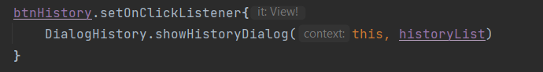

# xogame kotlin project
build.gradle file

##

# การออกแบบและ algorithm

## การจัดการตาราง
เมื่อเริ่มต้นแอปพลิเคชันจะกำหนดขนาดของตารางเริ่มต้นที่ 3x3 สามารถปรับขนาดที่ปุ่ม Edit

     

ตัวแปร activePlayer เป็นตัวตรวจสอบว่า ณ ตอนนี้เป็นตาของ Player คนไหน ส่วนตัวแปร numEdit เป็นตัวกำหนด size ในส่วนของตัวแปร statusGame จะตรวจสอบว่าเกมยังดำเนินไปหรือไม่

ฟังก์ชัน setBoard() จะเป็นฟังก์ชันสำหรับจัดการขนาดรูปแบบของตารางและกำหนดค่าให้กับปุ่ม 

ทำงานโดยนำตัวแปร numEdit ไปหาจำนวนปุ่มทั้งหมดเก็บไว้ที่ numButtons เพื่อนำไปเพิ่มปุ่มตามรูปแบบของตาราง

มีการตั้งค่าตัวแปร board เป็นตัวแปร Array 2 มิติ ตามขนาดของตาราง ใช้ในการเก็บค่า x,o เพื่อตรวจสอบผลชนะ

ส่วนการทำงานของปุ่มแต่ละปุ่มจะตรวจสอบว่าถ้าปุ่มนั้นยังไม่มีการกำหนดค่า และเกมยังคงดำเนินอยู่ จะทำการ set ค่า x,o ให้ปุ่มที่ฟังก์ชัน play(button) และ set ค่า ตัวแปร activePlayer เพื่อเปลี่ยนตาของผู้เล่น

## การเล่นและตรวจสอบผลชนะ
      
  

การเล่นจะทำงานที่ฟังก์ชัน play() จะทำงานโดยการ get ค่าตำแหน่งของปุ่มมาเก็บไว้ในตัวแปร row และ col ใช้ในการเก็บค่าในตัวแปร board เพื่อตรวจสอบผลชนะซึ่งจะตรวจสอบที่ฟังก์ชัน checkWin() แต่ถ้าหากยังไม่มีผู้ชนะจะทำการตรวจสอบผลเสมอที่ฟังก์ชัน checkDraw ต่อไป 

ฟังก์ชัน checkWin() จะมีการตรวจสอบ 3 รูปแบบดังนี้

- ตรวจสอบผลชนะแนวนอน จะตรวจสอบจากการวนลูปตาม size โดยใช้ตัวแปร rowWin ซึ่งจะเช็คว่าข้อมูลใน board ที่ตำแหน่ง row และ column นั้นๆ ถ้า มีค่าไม่เท่ากับ row นั้นๆใน column แรก หรือ row นั้นๆใน column แรกยังไม่ได้เก็บค่าอะไรจะเลิกตรวจสอบทันที เพราะใน row นั้นมีข้อมูลไม่เหมือนกันหรือยังมีข้อมูลไม่เต็ม row แต่ถ้ามีข้อมูลเหมือนกันและเต็ม row จะทำการประกาศผลชนะและบันทึกข้อมูลที่ฟังก์ชัน endGame()

- ตรวจสอบผลชนะแนวตั้ง จะตรวจสอบจากการวนลูปตาม size โดยใช้ตัวแปร colWin ซึ่งจะเช็คว่าข้อมูลใน board ที่ตำแหน่ง row และ column นั้นๆ ถ้า มีค่าไม่เท่ากับ row แรกใน column นั้นๆ หรือ row แรกใน column นั้นๆยังไม่ได้เก็บค่าอะไรจะเลิกตรวจสอบทันที เพราะใน column นั้นมีข้อมูลไม่เหมือนกันหรือยังมีข้อมูลไม่เต็ม column แต่ถ้ามีข้อมูลเหมือนกันและเต็ม column จะทำการประกาศผลชนะและบันทึกข้อมูลที่ฟังก์ชัน endGame()

- ตรวจสอบผลชนะมุมทะแยง จะตรวจสอบจากการวนลูปตาม size โดยใช้ตัวแปร diagonalWin 

ซึ่งถ้าเป็นมุมทะแยงซ้ายบนมาล่างขวาจะเช็คว่าข้อมูลใน board ที่ตำแหน่ง row และ column นั้นๆมีค่าไม่เท่ากับ row แรกใน column แรกไหม 

แต่ถ้าหากเป็นมุมทะแยงขวาบนมาล่างซ้ายจะเช็คว่าข้อมูลใน board ที่ตำแหน่ง row และ column นั้นๆมีค่าไม่เท่ากับ row แรกใน column สุดท้ายไหม

และจะทำการเช็คว่ามีข้อมูลไม่เต็มช่องหรือไม่ตามมุม หากมีข้อมูลเหมือนกันและเต็มช่องตามมุมทะแยงจะทำการประกาศผลชนะและบันทึกข้อมูลที่ฟังก์ชัน endGame()

ในส่วนของฟังก์ชัน checkDraw() จะทำงานก็ต่อเมื่อยังไม่มีผลการชนะในรูปแบบใดๆ โดยมีหลักการทำงานคือวนลูปตาม size โดยใช้ตัวแปร draw หากข้อมูลในบอร์ดทั้งหมดยังมีช่องว่างเหลืออยู่จะเลิกตรวจสอบทันที แต่หากข้อมูลเต็มหมดแล้วจะประกาศผลเสมอและบันทึกข้อมูลที่ฟังก์ชัน endGame()

## ประวัติการแข่งขันและการเก็บข้อมูล

ข้อมูลที่เก็บจะมี id, detailGame(ผลชนะหรือเสมอ), date(วันที่และเวลาการแข่งขัน) 

รูปแบบการบันทึกและดึงข้อมูลจะมีดังต่อไปนี้ HistoryDao->HistoryRepository->HistoryViewModel

โดยตอนบันทึกข้อมูลจะทำงานที่ฟังก์ชั่น endGame() หลังรู้ผลชนะหรือเสมอจะทำการเก็บผลและวันที่เวลาการแข่งขัน

ส่วนตอนดึงค่ามาแสดงจะดึงค่ามาเก็บไว้ที่ตัวแปร historyList

เมื่อทำการกดปุ่ม History จะส่งค่า historyList ไปที่ object DialogHistory เพื่อแสดงข้อมูลผลประวัติการแข่งขันใน Dialog

